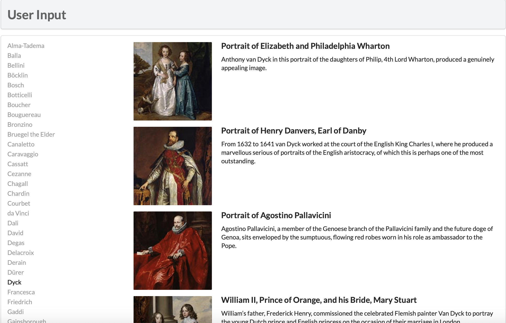
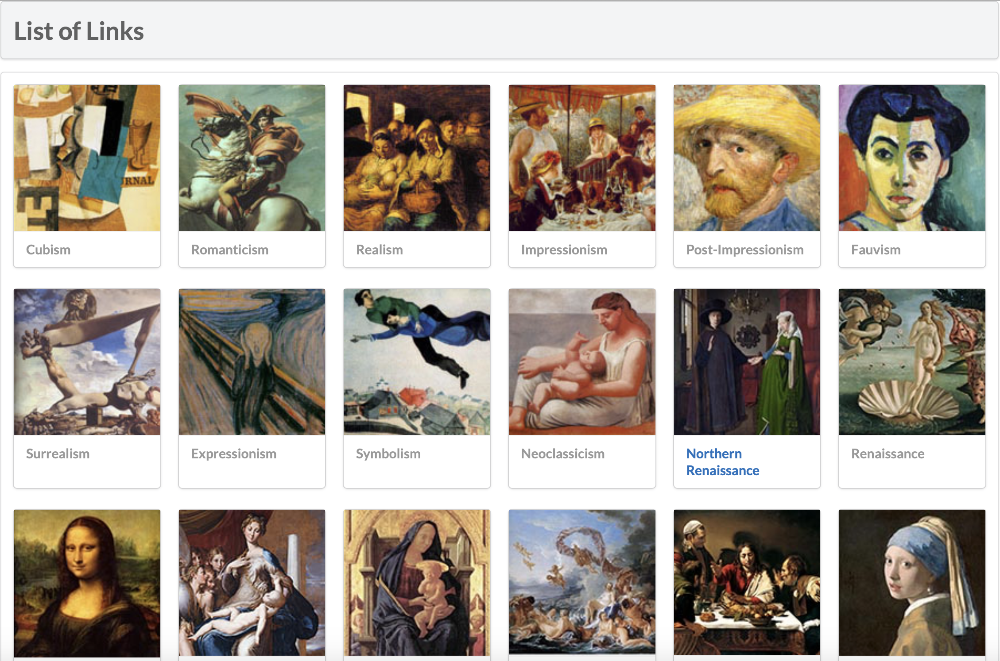

# Lab10设计文档

## Exercise7

### PDO

使用PDO对象访问数据库，通过query($sql)完成搜索

.png)

### mysqli

使用mysqli函数建立连接、搜索、释放和中断与数据库的连接，通过mysqli_query($connection, $sql)完成搜索

.png)

## Exercise8

### outputArtists()

根据LastName对数据排序，选取前30条数据依次输出并将ArtistID记录在href中，判断选中id是否与当前ArtistID匹配，匹配则添加active的class

### outputPaintings()

获取选中元素的id值（即ArtistID）并查找对应Paintings，循环调用outputSinglePainting()

### outputSinglePainting()

输出含单张Painting图片、标题和简介的html元素代码

## Exercise9

### 执行sql语句的方式

#### exec()

当执行 INSERT、UPDATE 和 DELETE 等不需要返回结果集的 SQL 语句时，可以使用 PDO 对象中的 exec() 方法。该方法成功执行后，将返回受影响的行数。但不会从 SELECT 查询语句中获取相应的结果。

#### query()

当执行需要返回结果集的 SELECT 查询语句时，可以使用 PDO 对象中的 query() 方法。如果该方法执行成功，则会返回一个 PDOStatement 对象

#### prepare()和execute()

当同一个查询需要多次执行时，使用预处理语句的方式来实现效率会更高。使用预处理语句就需要使用 PDO 对象中的 prepare() 方法去准备一个将要执行的查询，再使用PDOStatement 对象中的 execute() 方法来执行。优点是只需要解析查询一次。

## Exercise10

outputGenres()通过GenreID顺序查找数据，每查找到一个就调用一次outputSingleGenre();

outputSingleGenre()创建一个div包含有img和h4标签，调用constructGenreLink()设置标签中<a>元素href值和其中文本

