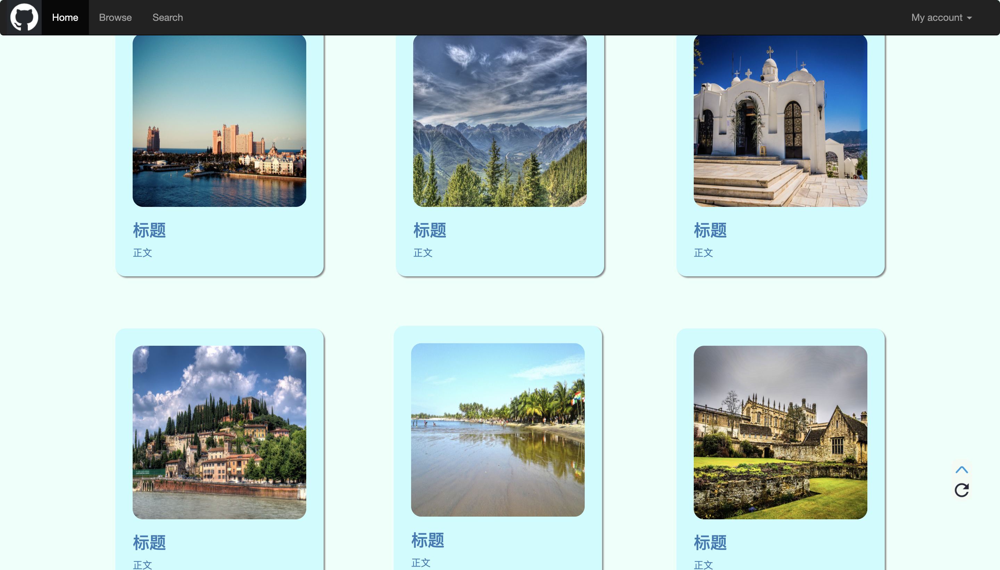
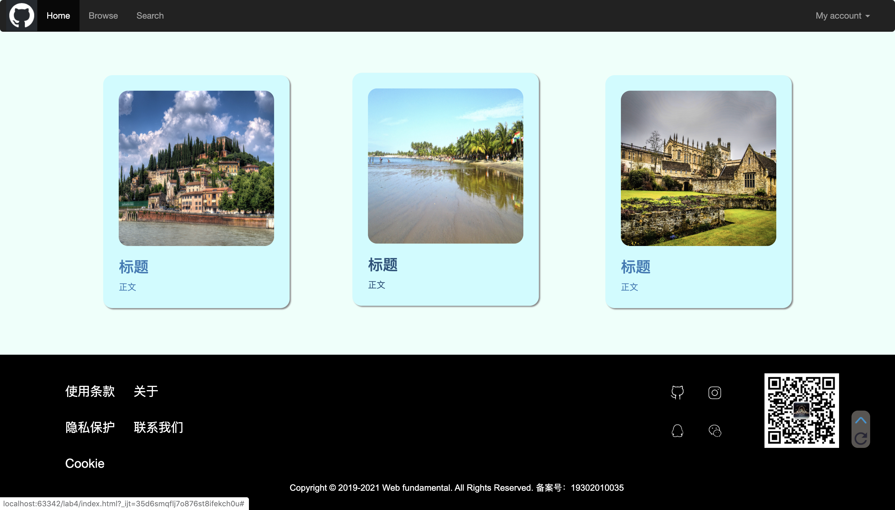

# **LAB4设计文档**

### 效果图展示






## 布局介绍

### 导航栏

采用bootstrap中的navbar，设置为深色，固定于视图顶部，去除了左右两端的边距。

```html
<nav class="navbar navbar-inverse navbar-fixed-top">...</nav>
```

### 头图（轮播图）

采用bootstrap中carousel，设置自动切换时间为3秒，鼠标移入时停止自动切换。

```html
<div id="myCarousel" class="carousel slide" data-ride="carousel" data-interval="3000" data-pause="hover" data-wrap="true">...</div>
```

### 图片展示

采用div嵌套，上下两个div中每个嵌套三个div，居中对齐。内层div布局为img--h3--p，背景设为淡蓝色，添加了阴影效果，为div和img分别设置了圆角。鼠标移入时产生向左上浮动效果，同时字体颜色加深。

### 页脚

分为两层，上层为三个div，左边和中间放置table，右边为img；下层为p元素。背景设置为黑色，字体颜色设置为白色，鼠标移入时变为灰色。

### 工具栏

背景为半透明的灰色，设置了圆角效果，固定于视图右下角。当页面位于上部时隐藏”返回顶部”按钮，离开时重新显示。点击”返回顶部”出现返回顶部的动画效果同时隐藏按钮。点击”刷新“按钮弹出提示”页面已刷新“