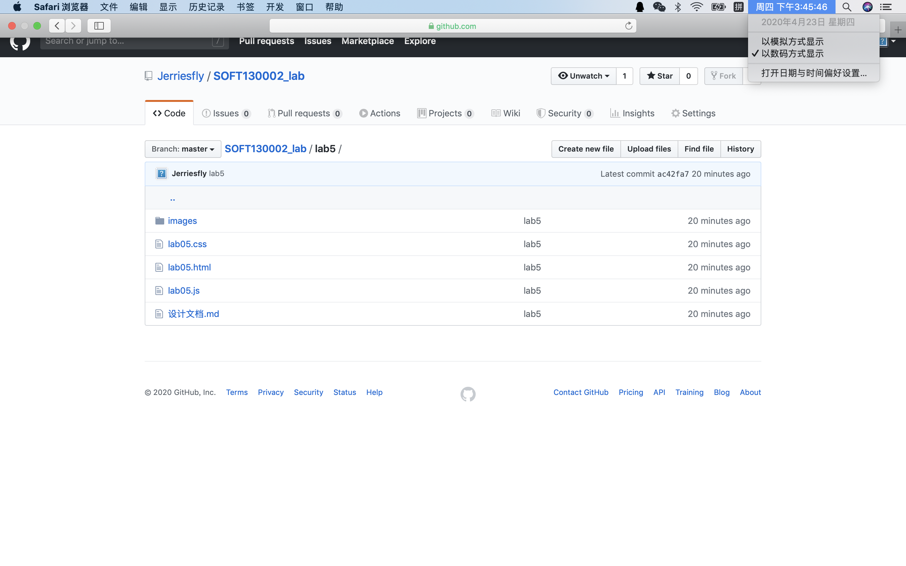
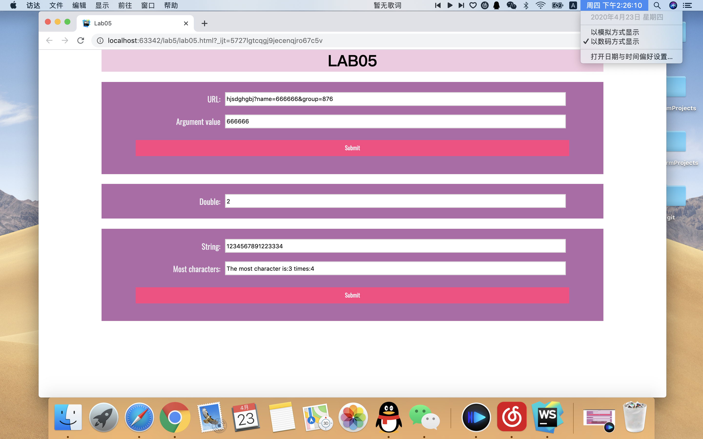

# Lab5设计文档

## 第一题

```javascript
let url = document.getElementById("url");
let url_submit = document.getElementById("url_submit");
let url_result = document.getElementById("url-result");
url_submit.addEventListener('click', showWindowHref);

function showWindowHref() {
    url_result.value = /(?<=[?&]name=).*?((?=&)|$)/.exec(url.value)[0];
}
```

主要使用了正则中和正反项预查和exec()函数

## 第二题

```javascript
const interval = 5000;
let mul = document.getElementById("mul");
mul.value = 1;
timeTest();

function timeTest() {
    let currentMinute = new Date().getMinutes();
    let times = 0;
    let start = setInterval(function () {
        times++;
        if (times > 10 || new Date().getMinutes() !== currentMinute) {
            clearInterval(start);
        } else {
            mul.value *= 2;
        }
    }, interval);
```

主要使用了setInterval()和clearInterval()函数，并通过getMinutes()判断是否分钟改变

## 第三题

```javascript
let most = document.getElementById("most");
let result = document.getElementById("most-result");
let most_submit = document.getElementById("most_submit");
most_submit.addEventListener('click', arrSameStr);

function arrSameStr() {
    let index = "";
    let max = 0;
    let obj = {};

    for (let i = 0; i < most.value.length; i++) {
        if (obj[most.value.charAt(i)]) {
            obj[most.value.charAt(i)]++;
        } else {
            obj[most.value.charAt(i)] = 1;
        }
    }

    for (let letter in obj) {
        if (obj[letter] > max) {
            max = obj[letter];
            index = letter;
        }
    }

    result.value = "The most character is:" + index + " times:" + max;
}
```

主要使用了关联数组来存储字符和对应出现个数，遍历数组确定最多出现字符和对应次数

## 截图

github截图：



网页效果截图：



