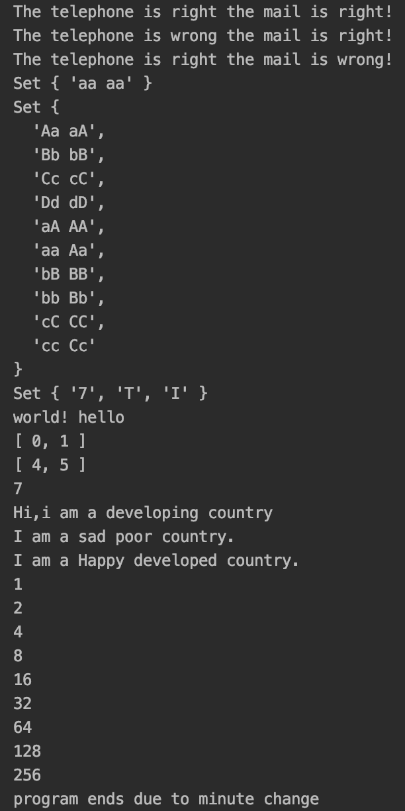

# Lab6设计文档

#### 正则表达式解释

##### 第二题：

```javascript
let tel_flag = /^1[34578]\d{9}$/.test(telephone);
let mail_flag = /^\w+@[a-zA-Z0-9]{2,10}(?:\.[a-z]{2,6}){1,3}$/.test(mail);
```

电话号码构成为1开头加上1位数字（移动、联通、电信）和九位任意数字构成。

邮箱我采用了比较通用的邮箱格式，对于一些比较魔幻的邮箱可能无法匹配。。。

首先是用户名部分，由数字字母和下划线组成，然后是@，最后是域名（基本上都是一级到三级，就没有再做扩展了）。

##### 第三题：

```javascript
 const reg= /(\b\w+\b)(?:\s\1)+\b/gi;
```

"\b\w+\b"匹配单词，采用贪婪模式并用\s\1匹配中间带有空格的多个忽略大小写的相同单词，如“is Is IS aaa"匹配出“is Is IS"，后续再拆为两项的组合。

#### 继承不同方式的理解

构造函数：在子类的构造函数开头用call调用父类的构造函数，能够继承父类的属性，但是无法复用父类的实例方法，也无法访问到父类原型中的属性和方法。

原型链：把子类的原型设置为父类的一个实例，可以覆盖父类的方法，缺点是会把父类的实例属性当作子类原型的属性，在向父类构造函数传参时子类会受影响。

Object.create()：将一个对象作为另一个对象的基础，创建了一个父类的原型的对象，再加上子类自己的属性作为子类的原型。

#### Map、Set、Array之间的区别和使用

获取大小map和set使用size，array使用length；

map中存放键值对，分别由一个键名和键值组成；

map中可以对一个键多次赋值，值为最终赋的值；array可以多次添加相同元素；set中添加重复元素不会发生改变；map和array可以相互转换。

#### 截图

##### Github仓库界面：



##### Webstorm中测试代码和运行结果界面：

```javascript
function test(){
    //2
    testMail("15821920957", "15821920957@gmail.com");
    testMail("11111111111", "15821920957@gmail.com");
    testMail("15821920957", "15821920957gmail.com");
    //3
    testRedundancy("aa aa bb aa cc");
    testRedundancy("aa Aa aA AA bb Bb bB BB cc Cc cC CC dd Dd dD DD");
    //4
    testKeyBoard("7z_This_is_a_testz","_hs_s_a_esz");
    //5
    testSpecialReverse("  hello  world!  ");
    //6
    twoSum([2, 7, 11, 15, 3, 6],9);
    //7
    lengthOfLongestSubstring("abcdebfgh");
    //8
    new DevelopingCountry().sayHi();
    new PoorCountry().saySad();
    new DevelopedCountry().sayHappy();
    //1
    testTime();
}

test();
```

##### 

